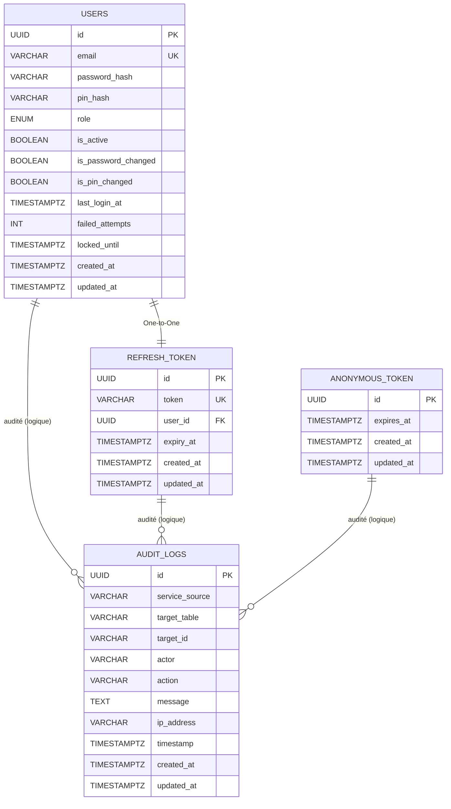
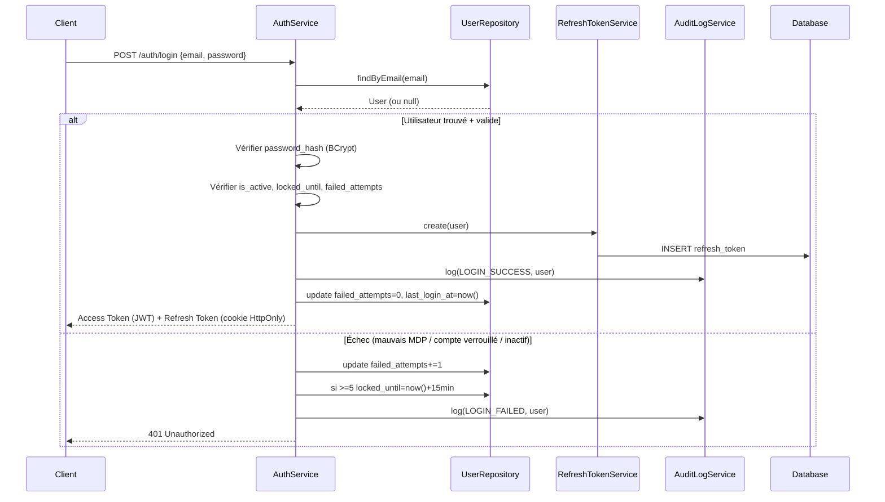
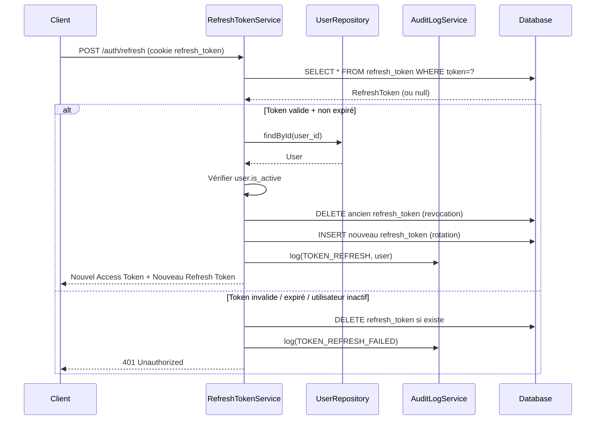

# Schéma de Base de Données - xflow-auth-service

> Documentation technique du schéma de base de données du service d'authentification XFlow.

---

## 📊 Vue d'ensemble

Le service `xflow-auth-service` utilise **4 tables** dans le schéma PostgreSQL `auth` :

| Table | Entité JPA | Description |
|-------|------------|-------------|
| **`auth.users`** | `User` | **Table centrale** — Utilisateurs (opérateurs, admins) |
| **`auth.refresh_token`** | `RefreshToken` | Tokens de rafraîchissement JWT (refresh tokens) |
| **`auth.anonymous_token`** | `AnonymousToken` | Tokens anonymes (accès temporaires / rate limiting) |
| **`auth.audit_logs`** | `AuditLog` | Journal d'audit (traçabilité actions utilisateurs/services) |

> **Note** : Le script `infra/docker/sql/01-init-schemas.sql` crée **uniquement les schémas + utilisateurs DB** (auth, map, tracking, routing, link_notif). Les tables elles-mêmes sont créées automatiquement par **Hibernate/JPA** (DDL auto) au démarrage de l'application (voir `application.properties` : `spring.jpa.hibernate.ddl-auto=update`).

---

## 🔗 Corrélations / Relations entre tables



### Détail des relations

| Relation | Type | Clé étrangère | Cascade / Comportement |
|----------|------|---------------|------------------------|
| **User → RefreshToken** | **One-to-One** (bidirectionnel) | `refresh_token.user_id → users.id` | `RefreshToken` owns la relation (`@OneToOne` + `@JoinColumn`) |
| **User → AnonymousToken** | **Aucune** (indépendant) | — | Token anonyme = session temporaire sans compte utilisateur |
| **User → AuditLog** | **One-to-Many (logique)** | *Pas de FK physique* | `AuditLog.target_table = 'users'` + `target_id = users.id::text` + `actor = users.email` |
| **RefreshToken → AuditLog** | **One-to-Many (logique)** | *Pas de FK physique* | `target_table = 'refresh_token'` |
| **AnonymousToken → AuditLog** | **One-to-Many (logique)** | *Pas de FK physique* | `target_table = 'anonymous_token'` |

---

## 📋 Détail des colonnes principales

### `auth.users` (Entité `User`)

| Colonne | Type | Contraintes | Description |
|---------|------|-------------|-------------|
| `id` | UUID | PK, Généré | Identifiant unique |
| `email` | VARCHAR | UQ, NOT NULL | Email unique (login) |
| `password_hash` | VARCHAR | NOT NULL | Hash BCrypt |
| `pin_hash` | VARCHAR | NULLABLE | Hash PIN (optionnel) |
| `role` | ENUM | NOT NULL | `SUPER_ADMIN`, `ADMIN`, `OPERATOR` |
| `is_active` | BOOLEAN | NOT NULL, DEF false | Compte activé ? |
| `is_password_changed` | BOOLEAN | NOT NULL, DEF false | Premier changement MDP effectué ? |
| `is_pin_changed` | BOOLEAN | NOT NULL, DEF false | Premier changement PIN effectué ? |
| `last_login_at` | TIMESTAMPTZ | NULLABLE | Dernière connexion |
| `failed_attempts` | INT | NOT NULL, DEF 0 | Tentatives échouées (brute-force) |
| `locked_until` | TIMESTAMPTZ | NULLABLE | Verrouillage temporaire |
| `created_at` / `updated_at` | TIMESTAMPTZ | Audité (DateBaseModel) | Horodatage création/MAJ |

**Index** :
- `idx_users_email` (UNIQUE) sur `email`
- `idx_users_is_active` sur `is_active`
- `idx_users_is_password_changed` sur `is_password_changed`
- `idx_users_is_pin_changed` sur `is_pin_changed`

---

### `auth.refresh_token` (Entité `RefreshToken`)

| Colonne | Type | Contraintes | Description |
|---------|------|-------------|-------------|
| `id` | UUID | PK, Généré | Identifiant unique |
| `token` | VARCHAR | UQ, NOT NULL | Token JWT refresh (opaque) |
| `user_id` | UUID | FK → users.id, NOT NULL | Propriétaire du token |
| `expiry_at` | TIMESTAMPTZ | NOT NULL | Expiration (ex: 7j) |
| `created_at` / `updated_at` | TIMESTAMPTZ | Audité | Horodatage |

**Index** :
- `idx_refresh_token_value` (UNIQUE) sur `token`
- `idx_refresh_token_expiry` sur `expiry_at`

**Méthode métier** :
```java
public boolean isExpired() {
    return expiryAt.isBefore(Instant.now());
}
```

---

### `auth.anonymous_token` (Entité `AnonymousToken`)

| Colonne | Type | Contraintes | Description |
|---------|------|-------------|-------------|
| `id` | UUID | PK, Généré | Identifiant unique |
| `expires_at` | TIMESTAMPTZ | NOT NULL | Expiration courte (ex: 15min) |
| `created_at` / `updated_at` | TIMESTAMPTZ | Audité | Horodatage |

---

### `auth.audit_logs` (Entité `AuditLog`)

| Colonne | Type | Contraintes | Description |
|---------|------|-------------|-------------|
| `id` | UUID | PK, Généré | Identifiant unique |
| `service_source` | VARCHAR | NOT NULL | Service émetteur (`auth-service`, `api-gateway`, etc.) |
| `target_table` | VARCHAR | NOT NULL | Table cible (`users`, `refresh_token`, etc.) |
| `target_id` | VARCHAR | NOT NULL | ID cible (UUID en string) |
| `actor` | VARCHAR | NOT NULL | Acteur (email user, service name, IP anonyme) |
| `action` | VARCHAR | NOT NULL | Action (`CREATE`, `UPDATE`, `DELETE`, `LOGIN`, `LOGOUT`, `PIN_CHANGE`, ...) |
| `message` | TEXT | NULLABLE | Détails JSON (ex: champs modifiés) |
| `ip_address` | VARCHAR | NULLABLE | IP client |
| `timestamp` | TIMESTAMPTZ | NOT NULL | Horodatage précis |
| `created_at` / `updated_at` | TIMESTAMPTZ | Audité | Horodatage |

**Index** :
- `idx_audit_logs_target` sur `(target_table, target_id)`
- `idx_audit_logs_actor` sur `actor`
- `idx_audit_logs_timestamp` sur `timestamp DESC`
- `idx_audit_logs_service_action` sur `(service_source, action)`

**Méthode utilitaire** :
```java
public String getTargetInfo() {
    return this.targetTable + "::" + this.targetId;
}
```

---

## 🔐 Flux d'authentification & corrélations

### Connexion (`POST /auth/login`)



---

### Rafraîchissement de token (`POST /auth/refresh`)



---

## 📋 Audit Log - Corrélation inter-services

| `service_source` | `target_table` | `action` typiques | `actor` |
|------------------|----------------|-------------------|---------|
| `auth-service` | `users` | `CREATE`, `UPDATE`, `DELETE`, `LOGIN_SUCCESS`, `LOGIN_FAILED`, `LOGOUT`, `PASSWORD_CHANGE`, `PIN_CHANGE`, `ACTIVATE`, `DEACTIVATE`, `UNLOCK` | `user.email` |
| `auth-service` | `refresh_token` | `CREATE`, `DELETE` (revocation), `ROTATE` | `user.email` |
| `auth-service` | `anonymous_token` | `CREATE`, `EXPIRE` | `anonymous:<ip>` |
| `api-gateway` | `users` / `routes` / ... | `ACCESS_DENIED`, `RATE_LIMITED` | `service-name` ou `user.email` |

### Exemple de requête d'audit pour un utilisateur

```sql
-- Tous les logs d'audit pour un utilisateur spécifique
SELECT * FROM auth.audit_logs 
WHERE target_table = 'users' 
  AND target_id = '550e8400-e29b-41d4-a716-446655440000'
ORDER BY timestamp DESC;

-- Logs de connexion (réussis + échoués)
SELECT * FROM auth.audit_logs 
WHERE target_table = 'users' 
  AND action IN ('LOGIN_SUCCESS', 'LOGIN_FAILED')
  AND target_id = '550e8400-e29b-41d4-a716-446655440000'
ORDER BY timestamp DESC;

-- Activité récente d'un service
SELECT * FROM auth.audit_logs 
WHERE service_source = 'auth-service'
  AND timestamp > NOW() - INTERVAL '24 hours'
ORDER BY timestamp DESC;
```

---

## 🔄 Migrations Flyway (Historique)

Les tables sont créées via migrations Flyway versionnées dans `src/main/resources/db/migration/` :

| Version | Fichier | Description |
|---------|---------|-------------|
| V1 | `V1__init_auth_schema.sql` | Crée table `users` (id, email, password_hash, role, created_at, updated_at, last_login_at) |
| V2 | `V2__add_auth_lock_fields.sql` | Ajoute `failed_attempts`, `locked_until` |
| V3 | `V3__add_pin_field.sql` | Ajoute `pin_hash` |
| V4 | `V4__add_anonymous_token.sql` | Crée table `anonymous_token` |
| V5 | `V5__add_refresh_token.sql` | Crée table `refresh_token` + FK vers users |
| V6 | `V6__add_active_field.sql` | Ajoute `is_active` + index |
| V7 | `V7__add_changed_fields.sql` | Ajoute `is_password_changed`, `is_pin_changed` + index |
| V8 | `V8__audit_log_schema.sql` | Crée table `audit_logs` + index |

---

## 📌 Points clés à retenir

| Point | Détail |
|-------|--------|
| **Schéma DB** | `auth` (isolé par utilisateur DB `auth_<app>`) |
| **PK** | UUID (généré par Hibernate via `GenerationType.UUID`) |
| **FK physique** | **Uniquement** `refresh_token.user_id → users.id` |
| **Audit** | **Pas de FK physiques** — corrélation logique via `target_table + target_id` |
| **Tokens anonymes** | Table indépendante, pas de lien vers `users` |
| **Rotation refresh token** | Oui (revocation + nouveau token à chaque refresh) |
| **Verrouillage compte** | `failed_attempts` + `locked_until` (protection brute-force, seuil: 5, durée: 15min) |
| **PIN** | Optionnel, hashé séparément (`pin_hash`), flags `is_pin_changed` |
| **Configuration** | `spring.jpa.properties.hibernate.default_schema=auth` |
| **Flyway** | `spring.flyway.schemas=auth`, `spring.flyway.locations=classpath:db/migration` |

---

## 🛠️ Entités JPA associées

| Fichier | Entité | Table |
|---------|--------|-------|
| `models/User.java` | `User` | `auth.users` |
| `models/RefreshToken.java` | `RefreshToken` | `auth.refresh_token` |
| `models/AnonymousToken.java` | `AnonymousToken` | `auth.anonymous_token` |
| `models/AuditLog.java` | `AuditLog` | `auth.audit_logs` |
| `models/enums/UserRole.java` | `UserRole` | — (enum) |
| `models/bases/DateBaseModel.java` | `DateBaseModel` | — (classe de base avec created_at/updated_at) |

---
